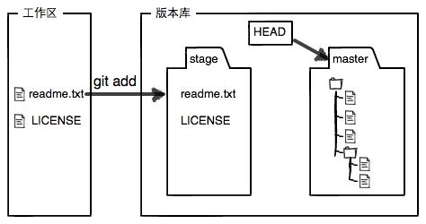
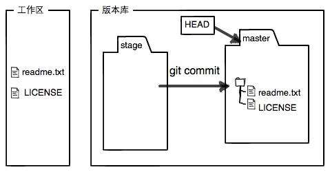
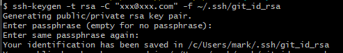

# 常用命令

# 1. mkdir/cd/pwd

mkdir learngit 创建一个空目录learngit

cd learngit 进入learngit

pwd 命令用于显示当前目录

# 2. git init

该命令把这个目录变成Git可以管理的仓库

运行之后就会发现多了一个`.git`的目录，这个目录是Git来跟踪管理版本库的

如果你没有看到`.git`目录，那是因为这个目录默认是隐藏的，用`ls -ah`命令就可以看见。

# 3. git add/commit

```bash
git add readme.txt
git commit -m "wrote a readme file"
```

简单解释一下`git commit`命令，`-m`后面输入的是本次提交的说明，可以输入任意内容，当然最好是有意义的，这样你就能从历史记录里方便地找到改动记录。

`git commit`命令执行成功后会告诉你，`1 file changed`：1个文件被改动（我们新添加的readme.txt文件）；`2 insertions`：插入了两行内容（readme.txt有两行内容）。

```bash
$ git add file1.txt
$ git add file2.txt file3.txt
$ git commit -m "add 3 files."
```

每次修改，如果不用`git add`到暂存区，那就不会加入到`commit`中。

# 4. git status

查看当前状态

# 5. git log

该命令显示从最近到最远的提交日志。

如果嫌输出信息太多，看得眼花缭乱的，可以试试加上`--pretty=oneline`参数：

git log --pretty=online

你看到的一大串类似`1094adb...`的是`commit id`（版本号）

# 6. git reset

```plain
git reset --hard HEAD^
```

`--hard`参数有啥意义？`--hard`会回退到上个版本的已提交状态，而`--soft`会回退到上个版本的未提交状态，`--mixed`会回退到上个版本已添加但未提交的状态。

```plain
git reset --hard 1094a
```

1094a 是commit id

# 7. git reflog

用来记录每一次命令

```plain
git reflog
e475afc HEAD@{1}: reset: moving to HEAD^
1094adb (HEAD -> master) HEAD@{2}: commit: append GPL
e475afc HEAD@{3}: commit: add distributed
eaadf4e HEAD@{4}: commit (initial): wrote a readme file
```

从输出可知，`append GPL`的commit id是`1094adb`

# 8. 工作区和暂存区

在电脑里能看到的目录，比如 **learngit** 文件夹就是一个工作区

## 8.1. 版本库 Repository

工作区有一个隐藏目录`.git`，这个不算工作区，而是Git的版本库。

Git的版本库里存了很多东西，其中最重要的就是称为stage（或者叫index）的**暂存区**，还有Git为我们自动创建的第一个分支`master`，以及指向`master`的一个指针叫`HEAD`。


*前面讲了我们把文件往Git版本库里添加的时候，是分两步执行的*：

- 第一步是用`git add`把文件添加进去，实际上就是把文件修改添加到暂存区；
- 第二步是用`git commit`提交更改，实际上就是把暂存区的所有内容提交到当前分支。

因为我们创建Git版本库时，Git自动为我们创建了唯一一个`master`分支，所以，现在，`git commit`就是往`master`分支上提交更改。

你可以简单理解为，**需要提交的文件修改通通放到暂存区，然后，一次性提交暂存区的所有修改。**

俗话说，实践出真知。现在，我们再练习一遍，先对`readme.txt`做个修改，比如加上一行内容：

```plain
Git is a distributed version control system.
Git is free software distributed under the GPL.
Git has a mutable index called stage.
```

然后，在工作区新增一个`LICENSE`文本文件（内容随便写）。

先用`git status`查看一下状态：

```plain
$ git status
On branch master
Changes not staged for commit:
  (use "git add <file>..." to update what will be committed)
  (use "git checkout -- <file>..." to discard changes in working directory)

	modified:   readme.txt

Untracked files:
  (use "git add <file>..." to include in what will be committed)

	LICENSE

no changes added to commit (use "git add" and/or "git commit -a")
```

Git非常清楚地告诉我们，`readme.txt`被修改了，而`LICENSE`还从来没有被添加过，所以它的状态是`Untracked`。

现在，使用两次命令`git add`，把`readme.txt`和`LICENSE`都添加后，用`git status`再查看一下：

```plain
$ git status
On branch master
Changes to be committed:
  (use "git reset HEAD <file>..." to unstage)

	new file:   LICENSE
	modified:   readme.txt
```

现在，暂存区的状态就变成这样了：



所以，`**git add**`**命令实际上就是把要提交的所有修改放到暂存区（Stage），然后，执行**`**git commit**`**就可以一次性把暂存区的所有修改提交到分支**。

```plain
$ git commit -m "understand how stage works"
[master e43a48b] understand how stage works
 2 files changed, 2 insertions(+)
 create mode 100644 LICENSE
```

一旦提交后，如果你又没有对工作区做任何修改，那么工作区就是“干净”的：

```plain
$ git status
On branch master
nothing to commit, working tree clean
```

现在版本库变成了这样，暂存区就没有任何内容了：



# 9. cat file

执行 `cat readme.txt` 时，系统会读取 `readme.txt` 文件的内容，并将其显示在终端或命令行窗口中。这对于快速查看文本文件（如说明文件、配置文件等）的内容非常有用。

# 10. git checkout -- filename

`git checkout -- file`可以丢弃工作区的修改：

```plain
$ git checkout -- readme.txt
```

命令`git checkout -- readme.txt`意思就是，把`readme.txt`文件在工作区的修改全部撤销，这里有两种情况：

一种是`readme.txt`自修改后还没有被放到暂存区，现在，撤销修改就回到和版本库一模一样的状态；

一种是`readme.txt`已经添加到暂存区后，又作了修改，现在，撤销修改就回到添加到暂存区后的状态。

总之，就是让这个文件回到最近一次`git commit`或`git add`时的状态。

- `git checkout -- file`命令中的`--`很重要，没有`--`，就变成了“切换到另一个分支”的命令，我们在后面的分支管理中会再次遇到`git checkout`命令。

## 10.1. git reset的使用

现在假定是凌晨3点，你不但写了一些胡话，还`git add`到暂存区了：

```plain
$ cat readme.txt
Git is a distributed version control system.
Git is free software distributed under the GPL.
Git has a mutable index called stage.
Git tracks changes of files.
My stupid boss still prefers SVN.

$ git add readme.txt
```

庆幸的是，在`commit`之前，你发现了这个问题。用`git status`查看一下，修改只是添加到了暂存区，还没有提交：

```plain
$ git status
On branch master
Changes to be committed:
  (use "git reset HEAD <file>..." to unstage)

	modified:   readme.txt
```

Git同样告诉我们，用命令`git reset HEAD <file>`可以把暂存区的修改撤销掉（unstage），重新放回工作区：

```plain
$ git reset HEAD readme.txt
Unstaged changes after reset:
M	readme.txt
```

`git reset`命令既可以回退版本，也可以把暂存区的修改回退到工作区。当我们用`HEAD`时，表示最新的版本。

再用`git status`查看一下，现在暂存区是干净的，工作区有修改：

```plain
$ git status
On branch master
Changes not staged for commit:
  (use "git add <file>..." to update what will be committed)
  (use "git checkout -- <file>..." to discard changes in working directory)

	modified:   readme.txt
```

还记得如何丢弃工作区的修改吗？

```plain
$ git checkout -- readme.txt

$ git status
On branch master
nothing to commit, working tree clean
```

整个世界终于清静了！

# 11. 删除文件

在Git中，删除也是一个修改操作，我们实战一下，先添加一个新文件`test.txt`到Git并且提交：

```plain
$ git add test.txt

$ git commit -m "add test.txt"
[master b84166e] add test.txt
 1 file changed, 1 insertion(+)
 create mode 100644 test.txt
```

一般情况下，你通常直接在文件管理器中把没用的文件删了，或者用`rm`命令删了：

```plain
$ rm test.txt
```

这个时候，Git知道你删除了文件，因此，工作区和版本库就不一致了，`git status`命令会立刻告诉你哪些文件被删除了：

```plain
$ git status
On branch master
Changes not staged for commit:
  (use "git add/rm <file>..." to update what will be committed)
  (use "git checkout -- <file>..." to discard changes in working directory)

	deleted:    test.txt

no changes added to commit (use "git add" and/or "git commit -a")
```

现在你有两个选择，一是确实要从版本库中删除该文件，那就用命令`git rm`删掉，并且`git commit`：

```plain
$ git rm test.txt
rm 'test.txt'

$ git commit -m "remove test.txt"
[master d46f35e] remove test.txt
 1 file changed, 1 deletion(-)
 delete mode 100644 test.txt
```

现在，文件就从版本库中被删除了。

另一种情况是删错了，因为版本库里还有呢，所以可以很轻松地把误删的文件恢复到最新版本：

**情况一：工作区文件删除，无其他操作**

1. `rm test.txt`

以下命令可恢复文件

1. `git restore test.txt`

**情况二：工作区文件删除，版本库文件删除**

1. `rm test.txt`
2. `git rm test.txt`
3. `git commit -m "remove test.txt"`

以下命令可恢复文件：

`git reset --hard HEAD^`

# 12. 远程仓库

由于你的本地Git仓库和GitHub仓库之间的传输是通过SSH加密的，所以，需要一点设置：

第1步：创建SSH Key。在用户主目录下，看看有没有.ssh目录，如果有，再看看这个目录下有没有`id_rsa`和`id_rsa.pub`这两个文件，如果已经有了，可直接跳到下一步。如果没有，打开Shell（Windows下打开Git Bash），创建SSH Key：

```plain
$ ssh-keygen -t rsa -C "youremail@example.com"
```

你需要把邮件地址换成你自己的邮件地址，然后一路回车，使用默认值即可，由于这个Key也不是用于军事目的，所以也无需设置密码。

------

如果一切顺利的话，可以在用户主目录里找到`.ssh`目录，里面有`id_rsa`和`id_rsa.pub`两个文件，这两个就是SSH Key的秘钥对，`id_rsa`是私钥，不能泄露出去，`id_rsa.pub`是公钥，可以放心地告诉任何人。

第2步：登陆GitHub，打开“Account settings”，“SSH Keys”页面：

然后，点“Add SSH Key”，填上任意Title，在Key文本框里粘贴`id_rsa.pub`文件的内容

点“Add Key”，你就应该看到已经添加的Key

------

为什么GitHub需要SSH Key呢？因为GitHub需要识别出你推送的提交确实是你推送的，而不是别人冒充的，而Git支持SSH协议，所以，GitHub只要知道了你的公钥，就可以确认只有你自己才能推送。

当然，GitHub允许你添加多个Key。假定你有若干电脑，你一会儿在公司提交，一会儿在家里提交，只要把每台电脑的Key都添加到GitHub，就可以在每台电脑上往GitHub推送了。

最后友情提示，在GitHub上免费托管的Git仓库，任何人都可以看到喔（但只有你自己才能改）。所以，不要把敏感信息放进去。

如果你不想让别人看到Git库，有两个办法，一个是交点保护费，让GitHub把公开的仓库变成私有的，这样别人就看不见了（不可读更不可写）。另一个办法是自己动手，搭一个Git服务器，因为是你自己的Git服务器，所以别人也是看不见的。这个方法我们后面会讲到的，相当简单，公司内部开发必备。

# 13. 克隆 Github 仓库到本地

## 13.1. 克隆仓库

```
git clone  https://github.com/username/repository.git  
```

 替换 `username` 和 `repository` 为你的 GitHub 用户名和仓库名。  

## 13.2.  进入项目目录  

`cd repository `  进入你克隆下来的仓库目录。  

 进入你克隆下来的  仓库目录 。  

## 13.3.  进行本地更改  

现在随意更改本地文件

## 13.4.  添加更改  

 完成修改后，添加文件到暂存区：  

```
git add .
```

`.`表示添加更改过的文件

## 13.5.  提交更改  

```
 git commit -m "你的提交信息"
```

 提交信息应该简洁描述你所做的更改。  

## 13.6.  同步更改到 GitHub  

```
 git push origin main  
```

- 该命令用于将本地仓库的 `main` 分支的更改推送到远程仓库的 `main` 分支。

查看 Github 库即可

- 执行 `git push origin main`时，显示：`fatal: unable to access 'https://github.com/Carolynhomes/Project_veriable-database.git/':The requested URL returned error: 403`

  - 这个一般是没有权限，那么一般两个方向

  - 第一就是，自己是否有这个仓库的管理权，没有就需要 xxxx

  - 第二种就是，Github 的认证方式

  - 我为了解决，采用第二种 SSH 认证

    - **生成 SSH 密钥**： 如果你没有现有的 SSH 密钥，可以生成一个新的：  ` ssh-keygen -t rsa -b 4096 -C "your_email@example.com"`

    - **添加 SSH 密钥到 GitHub**:   `cat ~/.ssh/id_rsa.pub`

    - 登录 GitHub，进入 **Settings** → **SSH and GPG keys**，将公钥添加到 GitHub。  

    - **更新远程仓库 URL 为 SSH**：  ` git remote set-url origin git@github.com:username/repository.git ` 

    - 再次推送：  ` git push origin main  `

  - 至此，解决 

- 如果我想克隆多个仓库，同时可以都在本地操作，那么我就需要 ` 生成多个 ssh key`,操作如下

  - `ssh-keygen -t rsa -C "xxx@xxx.com" -f ~/.ssh/git_id_rsa`

  - 邮箱是注册 github 的邮箱

  - 这里需要注意，该 ``ssh-keygen -t rsa -C "xxx@xxx.com"`` 命令会默认生成为 `id_rsa` 的公钥和 `id_rsa.pub` 的私钥文件。为了防止后续生成别的 ssh 被覆盖，我们可以使用上面的代码进行修改 ， 如图，我这里修改为 `git_id_rsa`




​		- 不设置密码

​		- 可以在.ssh 文件看到 `github_id_rsa` 文件和 `github_id_rsa.pub` 文件（隐藏）

​		- 将生成的 key 添加到 github 账户中去：打开生成的 `github_id_rsa.pub` 文件，全选并复制内容；

- 搞定

## 13.7. Bugs

- 执行`git clone xxxx`的时候显示：`error setting certificate file: F:/桌面/Git/mingw64/etc/ssl/certs/ca-bundle.crt`。

  - 你需要检查 ca-bundle.crt 文件是否存在。如果你确定文件确实存在，那么路径可能配置错误。

  - 检查文件是否存在于 F:/桌面/Git/mingw64/etc/ssl/certs/ca-bundle.crt 这个路径。

  - 如果不存在，你可以尝试重新安装 Git，确保安装时包含了证书文件。

  - 如果存在，那此时是由于 Git 无法找到或无法访问正确的证书文件导致的，此时可以手动设置正确的证书文件路径。使用以下命令重新配置 Git 的证书路径：`git config --global http.sslCAInfo "xxxx"

  - xxx 是你的 `ca-bundle.crt`路径`

# 14. Github如何clone两个仓库，并同时可以同步到github

> [!important]
>
> 刚开始最好先进入.ssh文件夹，一般在 `C:\Users\xxxx\.ssh`
>
> 或者  14.1 直接这么写：`ssh-keygen -t rsa -C "hu0925@88.com" -f ~/.ssh/xxx_id_rsa` 这样不需要起名字了，因为后面`xxx_id_rsa`就是自己创建的文件名

## 14.1 为第二个仓库生成新的SSH密钥

`ssh-keygen -t rsa -C "your_github_email"`

## 14.2 **命名新密钥文件**

接下来起一个名字即可，为了不跟刚开始的密钥文件重名，需要自己定义一个，初始的是`id_rsa`

## 14.3 密码

直接空

## 14.4 将新生成的公钥添加到GitHub

**复制公钥**： 使用以下命令查看新生成的公钥，并将其复制到剪贴板：

`cat ~/.ssh/your_customed_file.pub`

**添加公钥到GitHub**：

- 打开GitHub网页，登录到你的账户。
- 点击你的头像 -> "Settings" -> "Deploy keys" -> "Add deploy Key"。
- 将刚才复制的公钥粘贴到文本框中，并为它取一个名字，随便起，然后点击“Add SSH Key”。

## 14.5 配置SSH使用不同的密钥

**编辑 SSH 配置文件**： 现在，你需要配置SSH使用不同的密钥访问不同的仓库。编辑或创建SSH配置文件：

`自己创建一个（如果没有）`

建议使用`nano ~/.ssh/config`

>**`nano`** 是一个终端文本编辑器，用于编辑文件。它在许多 Linux 和 macOS 系统中是默认的文本编辑器，操作简单。Windows 用户也可以在 Git Bash 或其他 Unix 风格的终端中使用 `nano`。
>
>**`~/.ssh/config`** 是 SSH 配置文件的路径。`~` 代表当前**用户的主目录**，而 `.ssh/config` 是用于存储 SSH 客户端配置的文件。如果这个文件不存在，使用此命令会自动创建一个新的配置文件。

> [!warning]
>
> `nano`的使用方法:  
>
> **保存并退出**：`Ctrl + O` （保存文件），然后 `Ctrl + X`（退出编辑器）。
>
> **直接退出不保存**：`Ctrl + X`，然后按 `N` 不保存文件，直接退出。


**添加如下配置**到文件末尾，以便为每个仓库设置不同的密钥：

```bash
# 第一个仓库的配置
Host github.com-Repo1
    HostName github.com
    User git
    IdentityFile ~/.ssh/xxxxxx

# 第二个仓库的配置
Host github.com-Repo2
    HostName github.com
    User git
    IdentityFile ~/.ssh/yyyyy

```

`参数解释`：

在这个配置中：

- `Host github.com-Repo1` 是一个自定义别名，代表你与 `Repo1` 的连接。这个别名可以是任意名称，但要确保唯一。
  - 我一般喜欢 `Host github.com-仓库名`
- `HostName github.com` 是你要连接的实际服务器地址。
- `User git` 是使用的用户名（通常对 GitHub 使用 `git`）。
- `IdentityFile ~/.ssh/xxxxx` 是用于这个连接的 SSH 私钥文件路径。
  - 这个`xxxx` 就是`14.2`中的命名的新文件，可不是`.pub`文件

保存该文件后，运行 Git 命令时，SSH 客户端将根据你使用的 `Host`（如 `github.com-Repo1` 或 `github.com-Repo2`）自动选择合适的 SSH 密钥。

## 14.6 修改远程仓库URL

```bash
cd xxxx   # xxxx为第一个仓库目录
git remote set-url origin git@github.com-Repo1:yourusername/Repo1.git


cd yyyy   # xxxx为第二个仓库目录
git remote set-url origin git@github.com-Repo2:yourusername/Repo2.git
```

`参数解释`：

> `remote`：指 Git 仓库的远程仓库。Git 可以与多个远程仓库交互，如 `origin` 通常是默认的主远程仓库。
>
> `set-url`：表示你正在设置或更新远程仓库的 URL。
>
> `origin` 是 Git 默认的远程仓库名称。它通常指向你最初从远程服务器（如 GitHub、GitLab 或 Bitbucket）克隆的仓库。
>
> 当你从某个远程仓库克隆代码时，Git 默认将这个远程仓库命名为 `origin`。你可以使用不同的名称指向不同的远程仓库，但是 `origin` 是最常用的。
>
> 
>
> ### `git@github.com-Repo1:yourusername/Repo1.git`
>
> **这是新的远程仓库的 URL，它表示你希望 Git 使用 SSH 来访问 GitHub，并关联到某个具体的仓库**。让我们分解它的各个部分：
>
> - **`git@github.com-Repo1`**:
>   - `git@`：表示这是一个通过 SSH 连接的用户，通常 GitHub 使用 `git` 作为 SSH 用户名。
>   - `github.com-Repo1`：这个是 `Host` 别名，它来源于你之前在 `~/.ssh/config` 文件中定义的别名。
> - **`yourusername`**：这是你的 GitHub 用户名。
> - **`Repo1.git`**：表示你在 GitHub 上的具体仓库的名称，在这个例子中是 `Repo1`。
>   - `.git` 后缀是 Git 仓库的标准命名形式。

## 14.7 测试配置

**测试SSH连接**： 你可以分别测试两个SSH连接，以确保配置正确。

`ssh -T git@github.com-xxxx`    xxx是定义的别名

# 15. 分支管理

## 15.1. 创建 与合并 分支

```bash
# 创建dev分支，然后切换到dev分支
git checkout -b dev
# git checkout命令加上-b参数表示创建并切换，相当于以下两条命令：
git branch dev
git checkout dev

# 然后用 git branch命令查看当前分支
git branch
# git branch命令会列出所有分支，当前分支前面会标一个*号。

# 然后，我们就可以在dev分支上正常提交，比如对readme.txt做个修改，加上一行：
# Creating a new branch is quick.

# 提交
git add readme.txt 
git commit -m "branch test"

# 现在，dev分支的工作完成，我们就可以切换回master分支：
git checkout master
# 切换回master分支后，再查看一个readme.txt文件，刚才添加的内容不见了！
# 因为那个提交是在dev分支上，而master分支此刻的提交点并没有变

# 现在，我们把dev分支的工作成果合并到master分支上：
git merge dev
# git merge命令用于合并指定分支到当前分支。
# 合并后，再查看readme.txt的内容，就可以看到，和dev分支的最新提交是完全一样的。

# 注意到上面的Fast-forward信息，Git告诉我们，这次合并是“快进模式”，也就是直接把master指向dev的当前提交，所以合并速度非常快。
# 合并完成后，就可以放心地删除dev分支了：
git branch -d dev

# 删除后，查看branch，就只剩下master分支了：
git branch

# 创建并切换到新的dev分支，可以使用
git switch -c dev
# 直接切换到已有的master分支，可以使用
git switch master
```

Git鼓励大量使用分支：

- 查看分支：`git branch`
- 创建分支：`git branch <name>`
- 切换分支：`git checkout <name>`或者`git switch <name>`
- 创建+切换分支：`git checkout -b <name>`或者`git switch -c <name>`
- 合并某分支到当前分支：`git merge <name>`
- 删除分支：`git branch -d <name>`

# 报错汇总

## 1. 远程仓库和本地仓库合并冲突

一般是远程仓库包含你本地所没有的内容，此时的解决办法:

- `git pull origin main` 将远程仓库拉到你本地，当然会将你本地覆盖
- 进行你想要的修改（`那么问题来了，应该首先将原本的备份一下，然后直接复制过去 对吧`）
- 最后执行一系列的`push操作` ： `git add .`  `git commit -m "xxx"`  `git push origin main`

